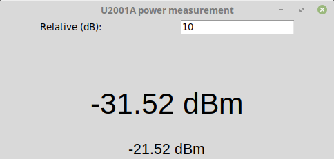

# IviGui
Jaanus Kalde, 2018

GUI to display measurements done over USBTMC. Connects to measurement device and displays the measurement result as a big number. Was written for Keysight U2001A power meter under Linux but will probably work with other similar devices (after ID change in the code) and other operating systems. Written as a free and basic alternative to Keysight’s BenchVue Power Meter/Power Sensor Control and Analysis.

## Installation
You need to install [python-usbtmc](https://github.com/python-ivi/python-usbtmc). Then just run this python script.

## Usage
Run the IviGui.py file with python 2.7. You should see window like this:

The biggest number in the center of the display is current relative measurement. Entry on the top is to write relative offset, for attenuator or loss compensation. The number on the bottom is actual measurement from the device. Each time a measurement is updated the dot above center number turns on to provide visual indication of update.